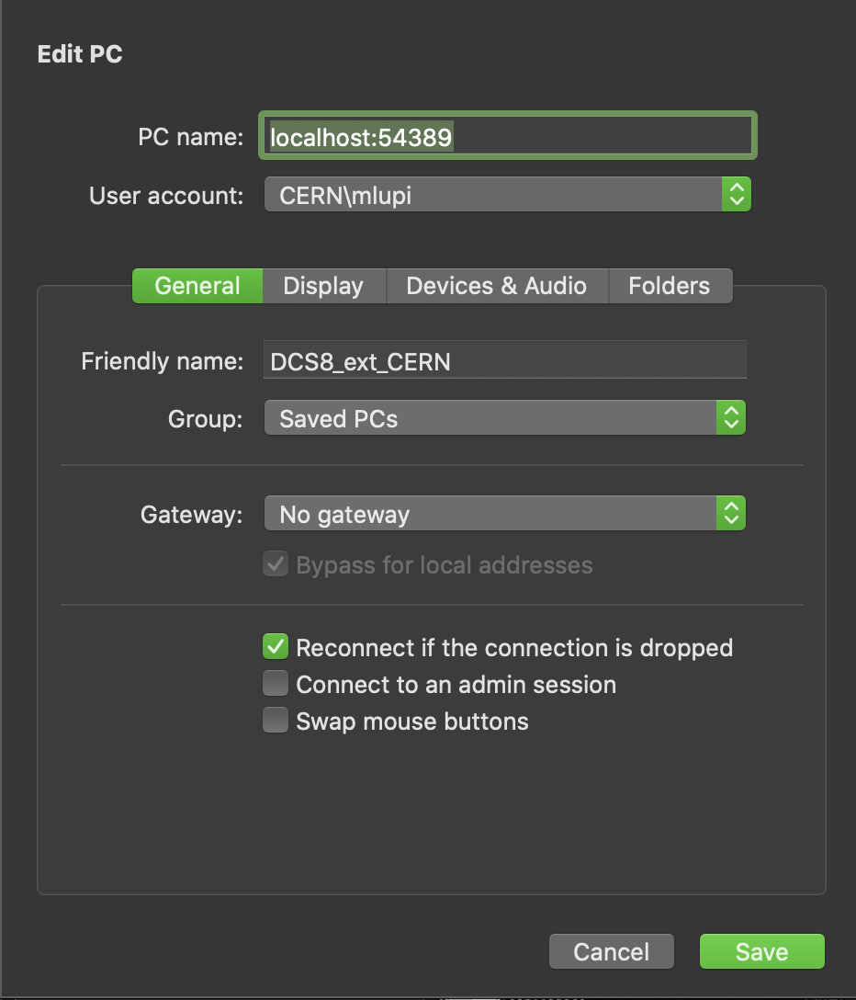

# Accessing Windows Machines Outside CERN

This guide contains the informations on how to access windows machines from outside CERN.
The instructions are OS dependent: pick the guide relative to your OS below.

## Prerequisites

To follow this procedure you need:

- A windows machine inside CERN network (e.g. `aliitsdcs8`) with a password-protected user.
- A linux machine inside CERN with your CERN user active.
- A valid connection to `lxplus`.
- Another machine to use outside CERN (telepathy is not supported yet).

## linux/macOS

### Configuring

#### .ssh/config

Add these lines to your `.ssh/config`, replacing `<your_hostname>` and `<your_linux_machine_inside_cern>` with the correct values.

The `LocalForward 83389 aliitsdcs8:3389` parameter indicates that the `localhost:83389` port is forwarded to the `aliitsdcs8:3389` port.
The machine `aliitsdcs8` is a windows (in this case) machine inside CERN, which you want to access using remote desktop.

``` bash
Host lxplus lxplus.cern.ch
    Hostname                  lxplus.cern.ch
    Port                      22
    User                      <your_hostname>
    ForwardX11                yes
    PreferredAuthentications  gssapi-with-mic,keyboard-interactive
    GSSAPIAuthentication      yes
    GSSAPIDelegateCredentials yes

Host <your_linux_machine_inside_cern>_forward
    Hostname <your_linux_machine_inside_cern>.cern.ch
    User              <your_hostname>
    Port              22
    ProxyCommand      ssh -W %h:22 lxplus
    LocalForward      6900 localhost:5900
    LocalForward      54389 aliitsdcs8:3389
    PreferredAuthentications  gssapi-with-mic,keyboard-interactive,password
    GSSAPIAuthentication      yes
    GSSAPIDelegateCredentials yes
```

#### Kerberos Authentication

Create this file: `/etc/krb5.conf` and paste there these lines:

``` bash
[libdefaults]
        default_realm = CERN.CH
        forwardable = true
        proxiable = true
        ticket_lifetime = 90000
        renew_lifetime = 432000
        renewable = true
        # uncomment two lines below if on a laptop .. will shorten to ~ 15 sec
        # long (60 sec) timeout on login if network is reachable but KDC is not ..
        kdc_timeout = 5
        max_retries = 3
        noaddresses = TRUE
        allow_weak_crypto = TRUE
[realms]
        CERN.CH = {
                kdc = cerndc.cern.ch
                #kpasswd_server = cerndc.cern.ch
                #admin_server = cerndc.cern.ch
                default_domain = cern.ch
        }

[domain_realm]
        .cern.ch = CERN.CH

[appdefaults]
        pam = {
        # uncomment next line for AFS tokens, install pam_afs_session.so first!
        #afs_cells=cern.ch
        }
```

#### Configuring Microsoft Remote Desktop (macOS only)

1. Install [Microsoft Remote Desktop](https://apps.apple.com/it/app/microsoft-remote-desktop-10/id1295203466?l=en&mt=12).
2. Create a new connection by clicking on the `+` symbol and clicking on `add PC`.
3. Fill in the parameter in image below:



**NOTE:** the user is the one in the Windows machine.

#### Configuring RDP connection (linux)

1. Configure RDP to connect to `localhost:54389`

### Connecting

1. `kinit <your_username>`
2. Insert password (or use `kinit --keychain <your_username>` instead of 1.)
3. `ssh <your_linux_machine_inside_cern>_forward` and leave the window open
4. Open remote desktop (macOS) or RDP and connect to the machine

## Windows/Putty

Follow [documentation](https://superuser.com/questions/1159811/openssh-proxycommand-equivalent-in-putty)
