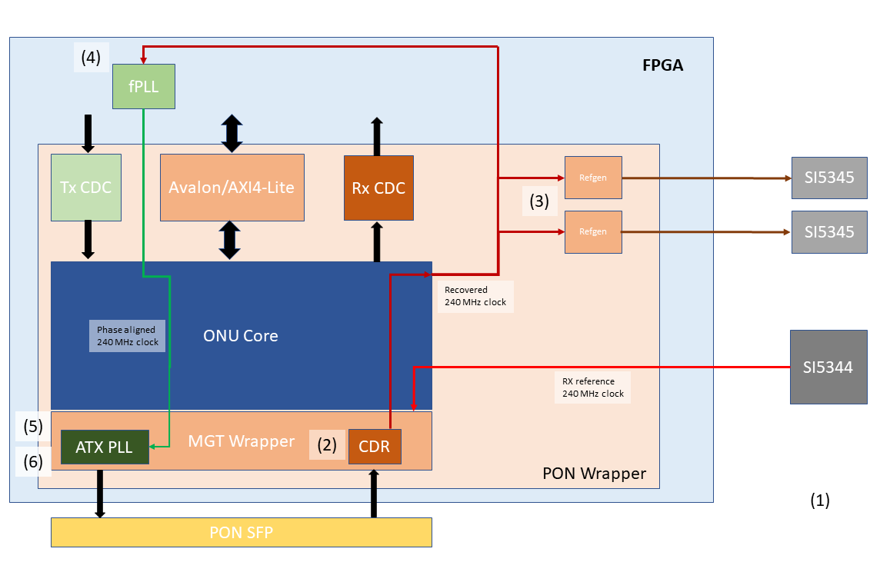

# Expert instructions/Documentation

## Table of Content
1. TTC configuration

## TTC configuration

First the external PLLs have to be configured. The selection between local and ttc clock happens in the SI5345 PLL (U48) by loading different register maps. In case of ttc clock, the `refgen` modules are also set to send 240 MHz clock. These modules forward the recovered PON clock - using ODDRs - to the pins connected to the external SI5345 PLLs' \#1 input. They can output 40, 120 or 240 MHz clock, in our case 240 MHz is selected.
(The ONU core originally had only 1 `refgen` module, but we needed duplicate it for the 2 external PLLs; this is an ALICE specific custom change to the official release).

The `set_locktoref` option of the RX CDR is turned off in both cases, otherwise without the PON link the ONU could always lock to the reference clock and we wouldn't see the link to be down.

### PON configuration

Here's a simplified diagram of the ONU module.

For configuring the PON link, the following steps are needed (see cru.ttc.calibTTC()):

||Step|Function in cru.ttc|
|---|---|---|
|1. | Configuring the SI5344 (already done in cru.ttc.configPlls()), which provides the 240 MHz reference clock for the PON Rx CDR | configPlls() |
|2. | Configuring the PON Rx transceiver |calibTTC()|
|3. | Configure the `refgen` modules to output 240 MHz|selectGlobal240()|
|4. | Configure the fPLL in the core logic, that takes the recovered 240 MHz clock and by adjusting the phase prepares it for the PON Tx (it's the reference clock of the ATX PLL)| configPonTx()|
|5. | Configuring the ATX PLL of the PON Tx transceiver| calibTTC()|
|6. | Configuring the PON Tx transceiver| calibTTC()|

The ONU module's status can be obtained by reading the `onu_status_o` register of the `onu_user_arri10_wrapper` module in onu.vhd.

#### PON upstream

For the PON upstream calibration the fPLL in the core logic needs to find the good phase position between the recovered 240 MHz clock (input) and its 240 MHz output clock. This is indicated by the `phase good` bit of the onu status register (`onu_status_o(1)`). In order to achieve this, it changes the phase of the output clock in discrete steps. The granularity of this phase shift equals to 1/4 VCO period. The VCO frequency is different for different initial phase shifts which can be changed in the IP parameter settings. Currently this initial phase shift is ~37 ns because this results in the highest VCO (13440.0 MHz). In this case the M-counter is 56 meaning that we can have 56 possible phase.

 Usually the phase is good - 55 out of the 56 -, but the logic tries to find a wrong position, so after that the phase can be shifted \"in the middle\" of the good range. 
Since it requires the downstream recovered clock to be present (and the ONU status bits to be OK) the upstream works only if the ttc clock is selected and the PON RX is configured properly.

Finally, in the LTU the `fullcal` needs to be run to complete the configuration. If successful, the ONU operational bit - `onu_status_o(3)` - is high.