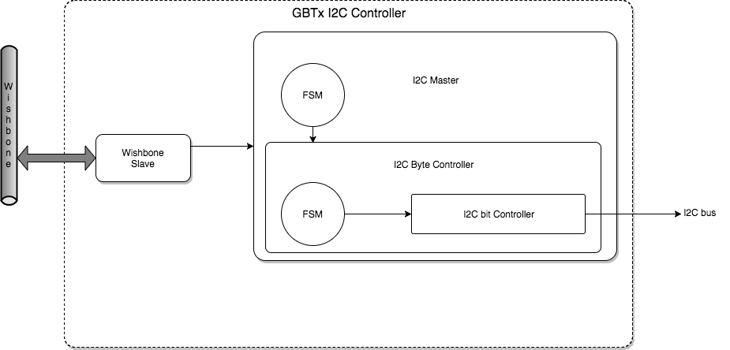

# Gbtx I2c Controller Module

## Function

The module is designed for:

*  Controlling and monitoring the three GBTx chips using one I2C bus

## Block Diagram



The modules is composed of:

*  A wrapper containing the wishbone slave and one I2C masters

## Files

| Function | File |
|  ------- | ----- |
| Top level                  | ```source/rtl/tmr_wrappers/i2c_gbt_tmr_wrapper.vhd``` |
| Top level (non wrapped)    | ```source/rtl/i2c_gbt_wrapper.vhd``` |
| Package                    | ```source/rtl/slaves/i2c_pkg.vhd``` |
| I2C Master                 | ```source/rtl/i2c_master_top.vhd``` |
| I2C Master Byte Controller | ```source/rtl/i2c_master_byte_ctrl.vhd``` |
| I2C Master Bit Controller  | ```source/rtl/i2c_master_bit_ctrl.vhd``` |

## Dependencies

| Function | Sub-Tree | File |
|  ------- | ----- | ----- |
| Voter  | Common_tmr | ```source/rtl/tmr/majority_voter_wbs_i.vhd``` |

## I/O

[Top level file](../source/rtl/tmr_wrappers/i2c_gbt_tmr_wrapper.vhd)

## Register Mapping

[Python File](../../board_support_software/software/py/ws_i2c_gbtx.py)

## Notes
